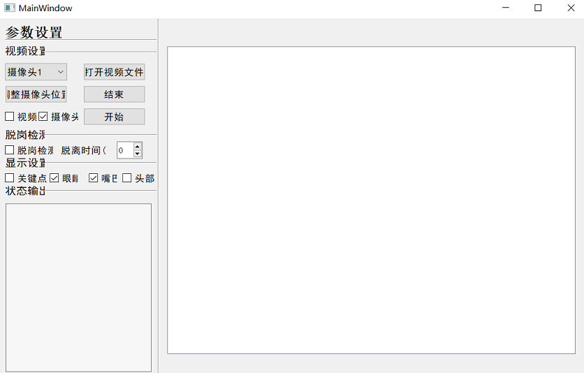
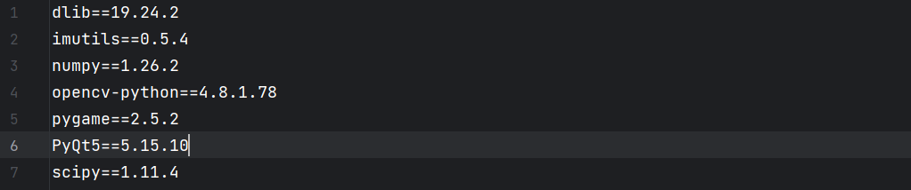
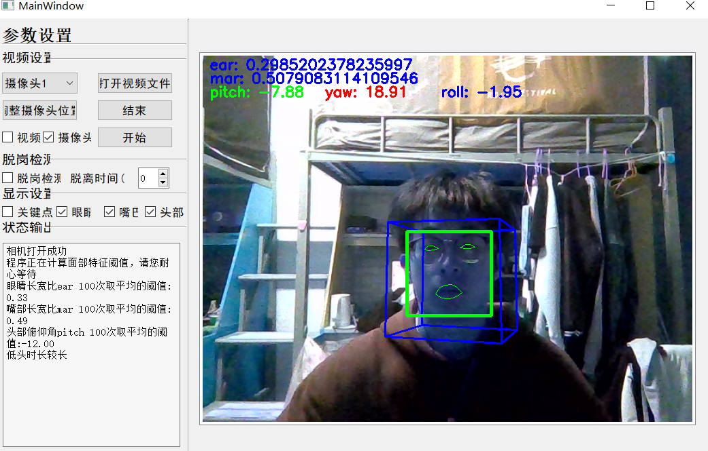
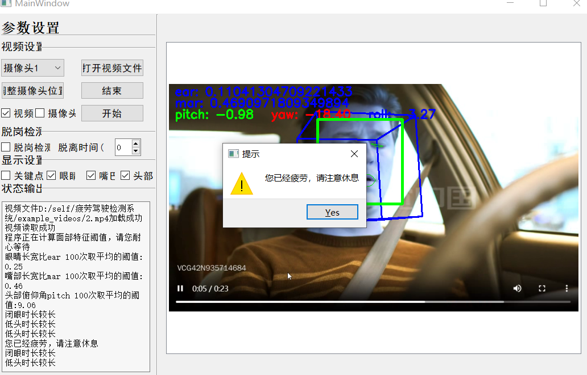

# 疲劳驾驶检测系统

### 1 关于本实验
* 疲劳驾驶检测系统通过监测驾驶人的眼睛状态，头部状态，嘴部状态等指标，识别出疲劳迹象，及时发出警示提醒。这种预警提醒可以帮助驾驶人意识到自己的疲劳状态，及时采取休息措施，防止发生事故。
* 基于OpenCV和dlib库实现对摄像头或视频中的人脸进行实时特征检测
* 使用PyQt5实现简单的界面设计
* 通过提取的人脸特征数据进行疲劳检测，判断是否处于疲劳状态并在必要时发出提示信息

### 1.1 项目简介
* 项目源码来源：https://gitee.com/liu-rongquan/Fatigue-detection-system?_from=gitee_search
* 此项目实现了一个疲劳驾驶检测系统（带UI界面）

* 版本日期：2023.12.20

### 1.2 项目结构介绍
* example_videos文件夹保存供检测使用的视频
* README_images文件夹保存此READNE.md用到的图片
* src文件夹包含运行文件main.py，界面类文件UI.py，工具类文件utils.py，预训练人脸关键点检测模型文件shape_predictor_68_face_landmarks.dat，以及警报声音文件warning.mp3

### 1.3 运行方法介绍
* 配置环境:dlib库的安装，也可以参照参照网上的教程
* #若未安装cmake
* conda install -c anaconda cmake
* #安装dlib
* conda install -c conda-forge dlib
* 其他东西直接pip install就可以了
* 以下是本项目在python3.9环境下使用到的主要库的版本

* 进入src文件夹，运行main.py文件，然后按照界面提示，打开摄像头或传入视频进行检测

### 2 实验步骤
* MainWindow类的实现
* AjustCamera_Thread类的实现
* Start_Thread类的实现

### 2.1 MainWindow类的实现
* 在main.py中创建MainWindow类，继承自Ui_MainWindow类。这个类主要做以下这些事：
* 1.初始化窗口，创建两个线程的实例
* 2.连接各种信号和槽函数
* 3.实现各个槽函数的功能

### 2.2 AjustCamera_Thread类的实现
* 在main.py中创建AjustCamera_Thread类。这个类主要做以下这些事：
* 1.定义信号对象用于发送图像，消息数据。初始化各种属性以及加载模型的方法
* 2.当用户点击调整摄像头按钮，打开摄像头，加载面部特征检测模型。如果人脸在摄像头可检测的范围内，会绘制人脸的12条轴线，并显示头部姿态的三个旋转角度。

### 2.3 Start_Thread类的实现
* 在main.py中创建Start_Thread线程类。这个类主要做以下这些事：
* 1.初始化各种变量（文件路径，摄像头选择等），实现了一些方法（检测功能开关，打开视频文件开关，播放音乐的方法等）
* 2.程序的核心功能：疲劳驾驶检测功能的实现。
  * ①	将线程状态设置为运行并向窗口发送消息，打开视频或摄像头
  * ②	初始化测试参数；初始化阈值。
  * ③	读取视频帧，对当前帧进行调整（维度缩减，灰度化，图像增强）
  * ④	使用面部检测模型detector检测人脸位置，在这里实现了脱岗检测功能
  * ⑤	使用predictor获取脸部特征信息，转为数组形式
  * ⑥	提取左眼，右眼，嘴巴坐标，计算左右眼长宽比（取二者均值）ear，嘴巴长宽比mar。获取头部姿态，取pitch(har),yaw,row旋转角度。并实时在屏幕中显示计算结果。
  * ⑦	计算100次ear,mar,har并求平均值，得到当前使用者的眼部，嘴部和头部俯仰角的阈值。
  * ⑧	 计算检测时间内，异常状态的次数。异常状态定义：1.ear眼睛长宽比 小于0.75倍阈值标记为异常；2.mar嘴巴长宽比 大于1.6倍阈值标记为异常；3.har头部旋转角度 跟阈值差大于标准值标记为异常。
  * ⑨	如果这三个异常状态的次数值与检测时间的比值大于设定的疲劳阈值FATIGUE_THRESH，则判定为：1.闭眼时间较长；2.张嘴时间较长；3.低头时间较长。并在屏幕中发送提示信息。
  * ⑩	如果被判定为疲劳的次数大于3次，则判定为：您已经疲劳，请注意休息。并播放警告音频。

### 3 实验的不足与拓展
### 3.1 实验不足
* 导入视频或者打开摄像头时间不能太短，因为模型需要循环100次计算眼部长宽比，嘴部长宽比，头部俯仰角并求平均作为阈值用于后面的疲劳判断。
* 模型在遮挡或非正脸方面表现不好。

### 3.2 实验拓展
* 使用yolo添加分心行为检测功能（玩手机，抽烟等）

